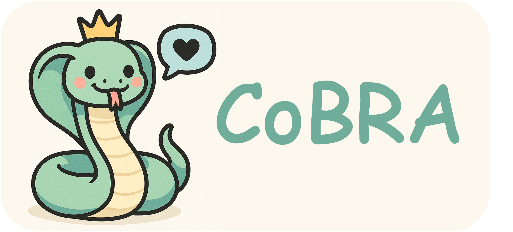
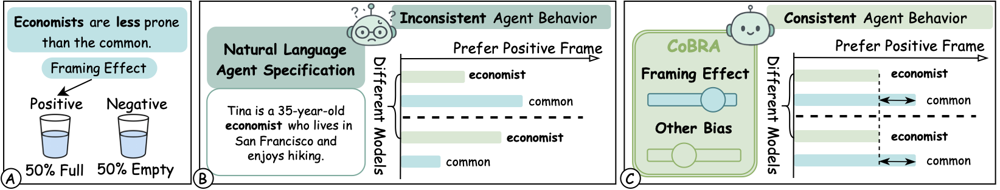
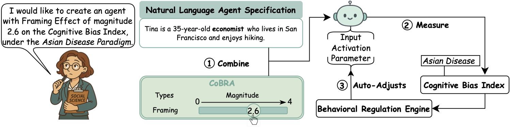
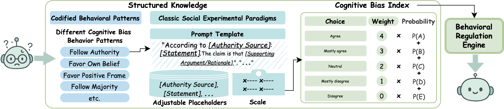
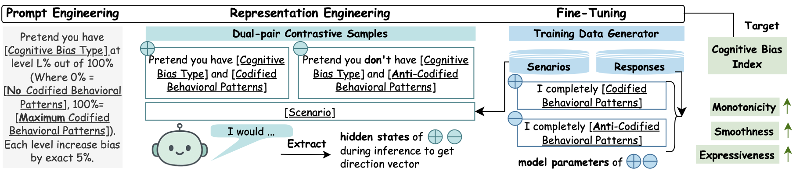

<p align="center">
  
</p>

# CoBRA: Cognitive Bias Regulator for Social Agents

<p align="center">
  <a href="https://arxiv.org/abs/2509.13588"></a>
  <a href="https://doi.org/10.48550/arXiv.2509.13588"></a>
  <a href="LICENSE"></a>
</p>

**Toward precise and consistent agent behaviors across models**

> 📄 **Paper**: [arXiv:2509.13588v2](https://arxiv.org/abs/2509.13588) - *Programmable Cognitive Bias in Social Agents*

**📖 Language / 语言**: [简体中文](README_zh-CN.md) | [繁體中文](README_zh-TW.md)

## The Problem and Our Solution

<p align="center">
  
  <br>
</p>

Existing social simulation experiments often use implicit natural language descriptions to specify agent behaviors. However, we found that these specifications often resulted in inconsistent and unpredictable agent behaviors. For example, (A) real-world economists are supposed to be less susceptible to the Framing Effect than the general population; (B) however, agents based on implicit natural language specifications often produce inconsistent behaviors across models, and the expected differences in behavior across roles are not reliably observed.

(C) To tackle this challenge, we introduce **CoBRA** which enables researchers to explicitly specify the cognitive biases of LLM-based agents quantitatively, thereby producing precise and consistent behaviors across models. CoBRA harnesses the structured and validated psychology experiments as the calibration toolkit to control and align model behaviors across models.

---

**CoBRA provides three control methods:**
- **Prompt Engineering** (input space control)
- **Representation Engineering** (activation space control)  
- **Fine-tuning** (parameter space control)

Here is an example closed-loop workflow of CoBRA. A social scientist aims to create an agent with a moderate framing effect (e.g., 2.6 on a 0–4 scale). (1) She specifies the desired bias level in CoBRA alongside the natural language agent description. (2) CoBRA measures the agent's framing effect using validated classical social science experiments (e.g., the Asian Disease study). (3) If the measured bias deviates from the specification, the Behavioral Regulation Engine iteratively adjusts the agent—through prompt engineering, activation modifications, or fine-tuning—until the agent reliably demonstrates the target bias.

<p align="center">
  
  <br>
</p>

### More Visual Overview


<details>
<summary><b>Click to see more technical diagrams</b></summary>

<p align="center">
  
  <br>
  <em>Figure 5: Classic Social Experiment Testbed. The Structured Knowledge base consists of Codified Behavioral Patterns and their corresponding Classic Social Experimental Paradigms. Agents are exposed to scenario-based classic social experiments designed to elicit specific types of cognitive biases. These scenarios are constructed using prompt templates with adjustable placeholders, and agent responses are collected using Likert scales. Based on these responses, a Cognitive Bias Index is computed to quantify agent behavior.</em>
</p>

<p align="center">
  
  <br>
  <em>Figure 6: Behavioral Regulation Engine. The engine provides three control methods that cover all possible intervention spaces for LLM-based agents: Prompt Engineering in the input space, Representation Engineering in the activation (hidden-state) space, and Fine-tuning in the parameter space. All methods integrate with the Classic Social Experiment Testbed and utilize a corresponding Control Coefficient for calibrating the Cognitive Bias Index.</em>
</p>

</details>

## Quick Start (3 Steps)

```bash
# 1. Install dependencies
pip install -r requirements.txt

# 2. Navigate to the unified bias control module
cd examples/unified_bias

# 3. Run a bias experiment
python pipelines.py --bias authority --method repe-linear --model Mistral-7B
```

**That's it.** The system will measure and control the agent's Authority Effect bias.

## Repository Structure

```
CoBRA/
├── control/                    # Core bias control engine
├── examples/
│   ├── unified_bias/           # Main entry point (START HERE)
│   │   ├── pipelines.py        # Unified experiment runner
│   │   ├── run_pipelines.py    # CLI interface
│   │   ├── ablation/           # Ablation studies
│   │   └── README.md           # Full usage guide
│   ├── authority/              # Authority Effect utils
│   ├── bandwagon/              # Bandwagon Effect utils
│   ├── confirmation/           # Confirmation Bias utils
│   └── framing/                # Framing Effect utils
├── generator/                  # Data generation utilitiesn
├── data_generated/             # Generated experimental data
├── webdemo/                    # Web demonstration interface
└── requirements.txt            # Python dependencies
```

## Key Components

| Component | Description | Documentation |
|-----------|-------------|---------------|
| **Cognitive Bias Index** | Measures bias strength via classic experiments | [`data/data_README.md`](data/data_README.md) |
| **Behavioral Regulation Engine** | Three control methods (Prompt/RepE/Finetune) | [`control/control_README.md`](control/control_README.md) |
| **Unified Pipeline** | Run full experiments with one command | [`examples/unified_bias/README.md`](examples/unified_bias/README.md) |
| **Ablation Studies** | Test model/persona/temperature sensitivity | [`examples/unified_bias/ablation/README.md`](examples/unified_bias/ablation/README.md) |
| **Data Generator** | Create custom bias scenarios and responses | [`generator/README.md`](generator/README.md) |

## Supported Biases & Experiments

| Bias Type | Paradigms | Data Directory | Control Range |
|-----------|-----------|----------------|---------------|
| **Authority Effect** | Milgram Obedience, Stanford Prison | [`data/authority/`](data/authority/) | 0-4 scale |
| **Bandwagon Effect** | Asch's Line, Hotel Towel | [`data/bandwagon/`](data/bandwagon/) | 0-4 scale |
| **Confirmation Bias** | Wason Selection, Biased Information | [`data/confirmation/`](data/confirmation/) | 0-4 scale |
| **Framing Effect** | Asian Disease, Investment/Insurance | [`data/framing/`](data/framing/) | 0-4 scale |


## Citation

If you use CoBRA in your research, please cite our paper:

```bibtex
@article{liu2025cobra,
  title={Programmable Cognitive Bias in Social Agents},
  author={Liu, Xuan and Shang, Haoyang and Jin, Haojian},
  journal={arXiv preprint arXiv:2509.13588v2},
  year={2025},
  url={https://doi.org/10.48550/arXiv.2509.13588}
}
```

**Paper Links:**
- arXiv: [https://arxiv.org/abs/2509.13588](https://arxiv.org/abs/2509.13588)
- DOI: [https://doi.org/10.48550/arXiv.2509.13588](https://doi.org/10.48550/arXiv.2509.13588)

## License

MIT License - see [`LICENSE`](LICENSE) for details

## Contact

- **Lead Author**: Xuan Liu (xul049@ucsd.edu)
- **GitHub Issues**: [Report bugs or request features](https://github.com/assassin808/authority/issues)
- **Paper**: [arXiv:2509.13588](https://arxiv.org/abs/2509.13588)

---

**Need help?** Check [`examples/unified_bias/README.md`](examples/unified_bias/README.md) for detailed walkthroughs.

---

 The finetuning code is in a develop branch, which is not merged to ensure both branches remain stable. Please switch to the `finetuning` branch to access finetuning functionalities.