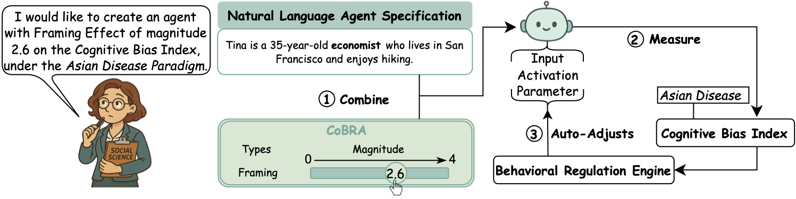

<p align="center">
  
</p>

# CoBRA: 實現跨模型精確一致的智能體行為

<p align="center">
  <a href="https://arxiv.org/abs/2509.13588"></a>
  <a href="https://doi.org/10.48550/arXiv.2509.13588"></a>
  <a href="LICENSE"></a>
</p>

> 📄 **論文**: [arXiv:2509.13588v2](https://arxiv.org/abs/2509.13588) - *Programmable Cognitive Bias in Social Agents*

**📖 Language / 语言**: [English](README.md) | [简体中文](README_zh-CN.md)

**CoBRA (Cognitive Bias Regulator for Social Agents / 社交代理的認知偏差調節器)** 利用結構化且經過驗證的心理學實驗作為校準工具包來控制和對齊跨模型的模型行為。

## 問題與解決方案

<p align="center">
  
  <br>
</p>

現有的社交模擬實驗通常使用隱式的自然語言描述來指定智能體行為。然而，我們發現這些規範往往導致不一致和不可預測的智能體行為。例如，(A) 現實世界中的經濟學家應該比普通大眾更不容易受到框架效應的影響；(B) 然而，基於隱式自然語言規範的智能體經常在不同模型中產生不一致的行為，角色間預期的行為差異無法可靠觀察到。

(C) 為了解決這一挑戰，我們引入了 **CoBRA**，它使研究人員能夠定量地明確指定基於LLM的智能體的認知偏差，從而在跨模型中產生精確和一致的行為。

---

**CoBRA 提供三種控制方法:**
- **提示工程** (輸入空間控制)
- **表示工程** (激活空間控制)  
- **微調** (參數空間控制)

以下是CoBRA的閉環工作流程示例。一位社會科學家旨在創建具有中等框架效應的智能體（例如，在0-4量表上得分2.6）。(1) 她在CoBRA中指定所需的偏差水平，同時提供自然語言智能體描述。(2) CoBRA使用經過驗證的經典社會科學實驗（例如，亞洲疾病研究）測量智能體的框架效應。(3) 如果測量的偏差偏離規範，行為調節引擎通過提示工程、激活修改或微調迭代調整智能體，直到智能體可靠地表現出目標偏差。

<p align="center">
  
  <br>
</p>


<details>
<summary><b>點選查看更多技術圖表</b></summary>

<p align="center">
  
  <br>
  <em>圖5: 經典社會實驗測試平台。結構化知識庫由編碼行為模式及其相應的經典社會實驗範式組成。智能體暴露在基於場景的經典社會實驗中，這些實驗旨在引發特定類型的認知偏差。這些場景使用可調整佔位符的提示模板建構，智能體響應通過李克特量表收集。基於這些響應，計算認知偏差指數來量化智能體行為。</em>
</p>

<p align="center">
  
  <br>
  <em>圖6: 行為調節引擎。引擎提供三種控制方法，涵蓋基於LLM的智能體的所有可能干預空間：輸入空間的提示工程、激活（隱藏狀態）空間的表示工程和參數空間的微調。所有方法都與經典社會實驗測試平台集成，並使用相應的控制係數來校準認知偏差指數。</em>
</p>

</details>

## 快速開始（3步）

```bash
# 1. 安裝相依套件
pip install -r requirements.txt

# 2. 進入統一偏差控制模組
cd examples/unified_bias

# 3. 執行偏差實驗
python pipelines.py --bias authority --method repe-linear --model Mistral-7B
```

**就這樣。** 系統將測量和控制智能體的權威效應偏差。

---

## 倉儲結構

```
CoBRA/
├── control/              # 核心RepE和提示引擎
│   ├── repe_experiment.py
│   ├── prompt_experiment.py
│   └── base.py
├── data/                 # 偏差場景和提示(4種偏差類型)
│   ├── authority/
│   ├── bandwagon/
│   ├── confirmation/
│   └── framing/
├── examples/             # 可重現實驗
│   └── unified_bias/     # 統一實驗框架 📖 [README](examples/unified_bias/README.md)
│       ├── pipelines.py
│       ├── run_batch.py
│       └── ablation/     # 消融研究 📖 [README](examples/unified_bias/ablation/README.md)
│           └── api_experiments/ # 封閉原始碼模型實驗 📖 [README](examples/unified_bias/ablation/api_experiments/README.md)
├── generator/            # 場景生成工具 📖 [README](generator/README.md)
├── demo/                 # Facebook從眾情緒實驗 📖 [README](demo/README.md)
├── webdemo/              # Web介面示範 📖 [README](webdemo/README.md)
└── figures/              # 論文圖表 📖 [README](figures/README.md)
```

---

## 關鍵元件

| 元件 | 描述 | 文件 |
|------|------|------|
| **Control** | RepE和提示工程實驗的核心引擎 | [control/](control/) |
| **Unified Bias** | 統一的偏差實驗框架(推薦用於可重現性) | [examples/unified_bias/README.md](examples/unified_bias/README.md) |
| **Ablation** | 角色、溫度和模型的消融研究 | [examples/unified_bias/ablation/README.md](examples/unified_bias/ablation/README.md) |
| **Generator** | OpenRouter驅動的場景生成 | [generator/README.md](generator/README.md) |
| **Demo** | 完整的Facebook從眾偏差示範 | [demo/README.md](demo/README.md) |

---

## 支援的偏差類型

| 偏差類型 | 描述 | 資料目錄 |
|---------|------|---------|
| **Authority (權威偏差)** | 傾向於服從權威人物 | [data/authority/](data/authority/) |
| **Bandwagon (從眾偏差)** | 傾向於跟隨群體意見 | [data/bandwagon/](data/bandwagon/) |
| **Confirmation (確認偏差)** | 傾向於尋找確認既有信念的資訊 | [data/confirmation/](data/confirmation/) |
| **Framing (框架效應)** | 決策受問題表達方式影響 | [data/framing/](data/framing/) |

---

## 引用

如果您在研究中使用CoBRA,請引用我們的論文:

```bibtex
@article{liu2025cobra,
  title={Programmable Cognitive Bias in Social Agents},
  author={Liu, Xuan and Shang, Haoyang and Jin, Haojian},
  journal={arXiv preprint arXiv:2509.13588v2},
  year={2025},
  url={https://doi.org/10.48550/arXiv.2509.13588}
}
```

**預印本連結**: [https://arxiv.org/abs/2509.13588](https://arxiv.org/abs/2509.13588)  
**DOI**: [https://doi.org/10.48550/arXiv.2509.13588](https://doi.org/10.48550/arXiv.2509.13588)

---

## 授權條款

本專案採用Apache 2.0授權條款 - 詳見 [LICENSE](LICENSE) 檔案。

---

## 致謝

我們感謝開源社群對本專案的支援,以及所有提供回饋和貢獻的研究人員。

---

## 聯絡方式

如有問題或合作諮詢,請透過以下方式聯絡:
- 📧 Email: [您的信箱]
- 🐛 Issues: [GitHub Issues](https://github.com/yourusername/CoBRA/issues)
