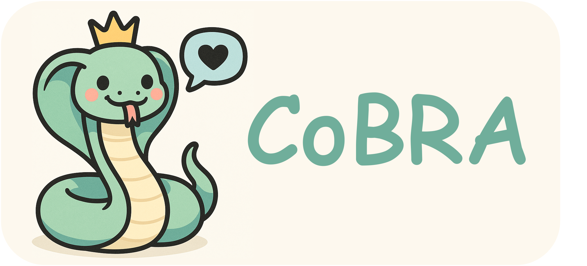
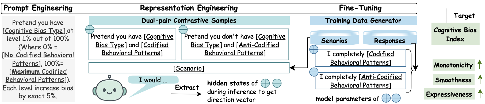

<p align="center">
  
</p>

# CoBRA: Cognitive Bias Regulator for Social Agents

<p align="center">
  <a href="https://arxiv.org/abs/2509.13588"></a>
  <a href="https://doi.org/10.48550/arXiv.2509.13588"></a>
  <a href="LICENSE"></a>
</p>

**為基於LLM的社交模擬提供可編程的認知偏差控制**

> 📄 **論文**: [arXiv:2509.13588v2](https://arxiv.org/abs/2509.13588) - *Programmable Cognitive Bias in Social Agents*

**📖 Language / 语言**: [English](README.md) | [简体中文](README_zh-CN.md)

**CoBRA** (Cognitive Bias Regulator for Social Agents / 社交代理的認知偏差調節器) 是一個用於大語言模型(LLM)中認知偏差可控調節的通用框架。它使用 **表示工程(RepE)** 和 **提示工程(Prompt Engineering)** 來精確控制AI系統中的偏差行為。

## CoBRA 是什麼?

CoBRA 提供了一個**統一框架**用於:
- 🎯 **精確控制** LLM中的4種關鍵認知偏差(權威偏差、從眾偏差、確認偏差、框架效應)
- 🧠 **表示工程(RepE)**: 透過操縱模型激活值來實現細粒度偏差控制
- 💬 **提示工程**: 使用Likert量表提示進行基準對比
- 📊 **可重現實驗**: 包含完整的程式碼、資料和分析工具

## 視覺概覽


*圖1: 概覽圖展示了CoBRA框架如何調節LLM中的偏差。我們首先從涉及特定認知偏差的對話中提取代表對照組(無偏差)和實驗組(有偏差)的文字對。然後,我們利用這些文字對生成正負樣本對,以訓練偏差方向。在推理階段,我們展示如何操縱模型的隱藏表示以實現對偏差程度的精細控制。*


*圖2: 用於提示工程基準的Likert量表提示建構。(a) 權威提示的高階直覺和(b) 完整提示範例,包括詳細的5點Likert量表定義和任務特定指令。*

<details>
<summary><b>📊 點選查看技術細節圖表(圖5-6)</b></summary>


*圖5: RepE控制在不同Transformer層級的有效性。結果來自於Mistral-7B-Instruct-v0.3模型在6個不同社會心理學場景上的測試,每個場景涵蓋4種偏差類型。圖表展示了Y軸表示的偏差行為相對於未調節基線的變化。RepE干預主要影響中間層(12-22層),符合先前研究關於概念資訊定位的發現。有趣的是,淺層和深層的干預產生了最小的行為改變,這表明關鍵的偏差相關表示主要編碼在中間層級。*


*圖6: 在25個不同角色上的偏差控制有效性。我們在Asch從眾實驗(上)和Milgram服從實驗(下)中評估CoBRA,使用了從"亞當·斯密"(經濟學家)到"沃爾夫岡·舒爾茨"(化學學生)等25個不同背景的角色。每個子圖都顯示了各個角色在5個Likert偏差水平下的平均選擇機率,展示了一致的偏差控制效果,無論角色背景如何。*

</details>

---

## 快速開始

### 1. 複製倉儲
```bash
git clone https://github.com/yourusername/CoBRA.git
cd CoBRA
```

### 2. 安裝相依套件
```bash
pip install -r requirements.txt
```

### 3. 執行實驗
```bash
# 對權威偏差執行RepE實驗
python examples/unified_bias/pipelines.py --bias authority --method repe

# 對確認偏差執行提示基準實驗
python examples/unified_bias/pipelines.py --bias confirmation --method prompt_likert

# 對所有偏差執行完整批次實驗
python examples/unified_bias/run_batch.py
```

查閱 [統一偏差實驗README](examples/unified_bias/README.md) 瞭解完整的使用指南。

---

## 倉儲結構

```
CoBRA/
├── control/              # 核心RepE和提示引擎
│   ├── repe_experiment.py
│   ├── prompt_experiment.py
│   └── base.py
├── data/                 # 偏差場景和提示(4種偏差類型)
│   ├── authority/
│   ├── bandwagon/
│   ├── confirmation/
│   └── framing/
├── examples/             # 可重現實驗
│   └── unified_bias/     # 統一實驗框架 📖 [README](examples/unified_bias/README.md)
│       ├── pipelines.py
│       ├── run_batch.py
│       └── ablation/     # 消融研究 📖 [README](examples/unified_bias/ablation/README.md)
│           └── api_experiments/ # 封閉原始碼模型實驗 📖 [README](examples/unified_bias/ablation/api_experiments/README.md)
├── generator/            # 場景生成工具 📖 [README](generator/README.md)
├── demo/                 # Facebook從眾情緒實驗 📖 [README](demo/README.md)
├── webdemo/              # Web介面示範 📖 [README](webdemo/README.md)
└── figures/              # 論文圖表 📖 [README](figures/README.md)
```

---

## 關鍵元件

| 元件 | 描述 | 文件 |
|------|------|------|
| **Control** | RepE和提示工程實驗的核心引擎 | [control/](control/) |
| **Unified Bias** | 統一的偏差實驗框架(推薦用於可重現性) | [examples/unified_bias/README.md](examples/unified_bias/README.md) |
| **Ablation** | 角色、溫度和模型的消融研究 | [examples/unified_bias/ablation/README.md](examples/unified_bias/ablation/README.md) |
| **Generator** | OpenRouter驅動的場景生成 | [generator/README.md](generator/README.md) |
| **Demo** | 完整的Facebook從眾偏差示範 | [demo/README.md](demo/README.md) |

---

## 支援的偏差類型

| 偏差類型 | 描述 | 資料目錄 |
|---------|------|---------|
| **Authority (權威偏差)** | 傾向於服從權威人物 | [data/authority/](data/authority/) |
| **Bandwagon (從眾偏差)** | 傾向於跟隨群體意見 | [data/bandwagon/](data/bandwagon/) |
| **Confirmation (確認偏差)** | 傾向於尋找確認既有信念的資訊 | [data/confirmation/](data/confirmation/) |
| **Framing (框架效應)** | 決策受問題表達方式影響 | [data/framing/](data/framing/) |

---

## 引用

如果您在研究中使用CoBRA,請引用我們的論文:

```bibtex
@misc{yao2025cobra,
  title={CoBRA: Cognitive Bias Representation and Adjustment in Large Language Models},
  author={Yao, Boshi and Wang, Kefan and Hu, Yixin and Zhang, Yang and Zhou, Qiyang and Wang, Tong and Wang, Yujia and Bhattamishra, Sadhika and Fung, Yi},
  year={2025},
  eprint={2509.13588},
  archivePrefix={arXiv},
  primaryClass={cs.CL},
  url={https://arxiv.org/abs/2509.13588},
  doi={10.48550/arXiv.2509.13588}
}
```

**預印本連結**: [https://arxiv.org/abs/2509.13588](https://arxiv.org/abs/2509.13588)  
**DOI**: [https://doi.org/10.48550/arXiv.2509.13588](https://doi.org/10.48550/arXiv.2509.13588)

---

## 授權條款

本專案採用Apache 2.0授權條款 - 詳見 [LICENSE](LICENSE) 檔案。

---

## 致謝

我們感謝開源社群對本專案的支援,以及所有提供回饋和貢獻的研究人員。

---

## 聯絡方式

如有問題或合作諮詢,請透過以下方式聯絡:
- 📧 Email: [您的信箱]
- 🐛 Issues: [GitHub Issues](https://github.com/yourusername/CoBRA/issues)
